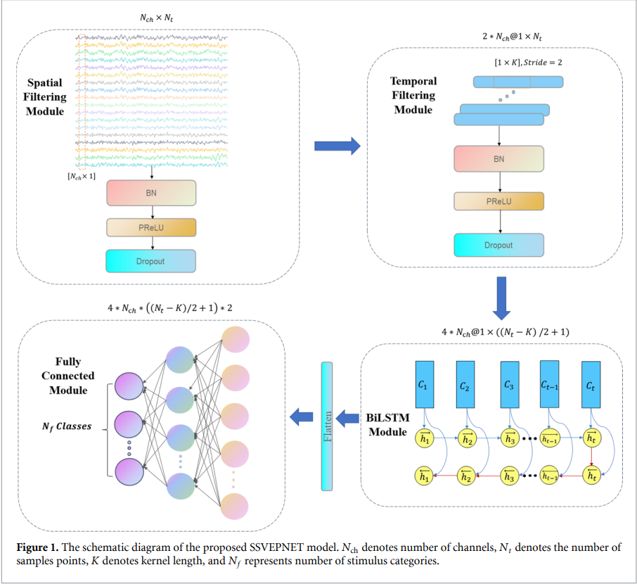

# Introduction
This repository provides source code for replication of SSVEPNet [1]. SSVEPNet is an efficient CNN-LSTM mixed network with spectral normalization and label smoothing technologies. It aims to reduce the gap of classification performance between intra- and inter-subject experiments and implement a high-performance SSVEP-BCI system with limited training data.



# File Description
- `data/Dial`: A 12-class public SSVEP dataset [2].
- `Model/SSVEPNet.py`: Implementation of CNN-LSTM mixed network with pytorch.
- `Result/DatasetA`: Recorded classification results.
- `Train/Classifier_Trainer.py`: Training code for any DL-based classifer model.
- `Test/SSVEPNet_Test.py`: Evaluating the performance for SSVEPNet.
- `Utils/EEGDataset.py`: Providing the data for intra- and inter- subject experiments.
- `Utils/Constraint.py`: Implementation of spectral normalization and spatial convolution kernel constraint. 
- `Utils/LossFunction.py`: Implementation of visual attention based label smooth techniques.
- `Utils/Ploter`: Plotting histogram to visualize the classification results.


# Running Environment
* Setup a virtual environment with python 3.8 or newer
* Install requirements

```
pip install -r Resource/requirements.txt
```

## Train and Test
```
cd Test
python SSVEPNet_Test.py
```

# Reference
[1] Pan Y, Chen J, Zhang Y, et al. An efficient CNN-LSTM network with spectral normalization and label smoothing technologies for SSVEP frequency recognition[J]. Journal of Neural Engineering, 2022, 19(5): 056014. <a href="https://iopscience.iop.org/article/10.1088/1741-2552/ac8dc5/meta">https://iopscience.iop.org/article/10.1088/1741-2552/ac8dc5/meta</a>

[2] Nakanishi M, Wang Y, Wang Y T, et al. A comparison study of canonical correlation analysis based methods for detecting steady-state visual evoked potentials[J]. PloS one, 2015, 10(10): e0140703. <a href="https://journals.plos.org/plosone/article?id=10.1371/journal.pone.0140703">https://journals.plos.org/plosone/article?id=10.1371/journal.pone.0140703</a>


